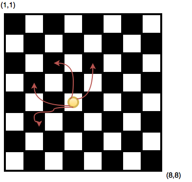
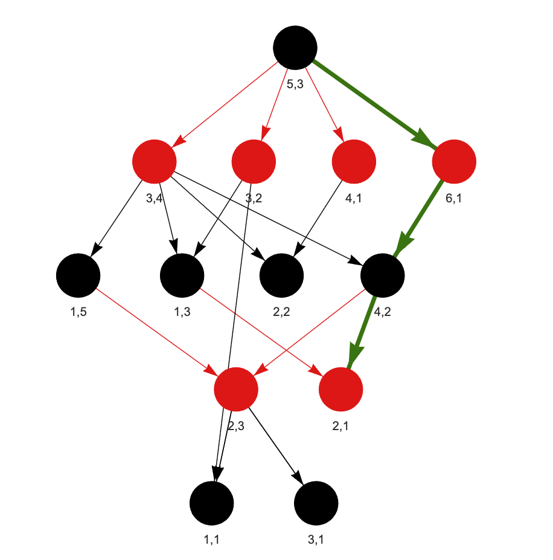

# DSAprep Project

## Overview
This project is my attempt to help users (and myself :D) visualize and solve problems related to data structures and algorithms (DSA). So far, it includes a tool for simulating a coin chessboard game and generates a hierarchical directed graph with the first winning path found highlighted. With simple adjustments it can be used to traverse any binary tree or otherwise using DFS. It includes a js and python implementation.

## Exercise - A Chessboard Game
Two players are playing a game on a nxn board. The game starts with a coin placed in (x,y) coordinated. Players take alternating turns moving thr coin, the first player who is unable to make a move loses the game.
The problem is fully defined on [hackerrank](https://www.hackerrank.com/challenges/a-chessboard-game-1/problem?isFullScreen=true)

Given a set of initial coordinates of the player's coin and assuming perfect play, determine which player will the game and what are the moves they need to make.

Valid moves are considered the following:
    [-2, -1], 
    [-1, -2],
    [-2, +1], 
    [+1, -2]



---

## Setup Instructions

### Prerequisites
Ensure you have the following installed on your system:
- [pyvis](https://pyvis.readthedocs.io/en/latest/install.html) 

### Run the project
Run `AChessboardGame.py` and call the `chessboardGame(...)` function
The function will create an html file with the directed graph.

### Example Output
```python
# winnig player
First 
# first found winnig path
Winning Path: [(5, 3), (6, 1), (4, 2), (2, 1)]
```

*Player 1 moves are denoted by red edges and nodes*